# Rapport de projet

**Le Spaghettoscope**

par Nicolas Hurtubise

## Concept

Ce projet visait la création d'un écran de projection "3D", l'idée
étant de projeter de la lumière sur une structure clairsemée, dans
laquelle un grand nombre de profondeurs différentes sont visibles peu
importe le point de vue.

La structure retenue est une sculpture de spaghettis plantés dans un
bloc de styrofoam pour arrangements floraux. La translucidité des
pâtes, le coût modique et la facilité de se procurer le matériel ont
guidés ce choix.

Globalement, le projet consistait à :

1. Créer l'arrangement de pâtes
2. Reconstruire un modèle 3D de la structure
3. Projeter des images générées en considérant la disposition des
   points du monde en trois dimensions

La reconstruction 3D a été effectuée via une
[méthode de reconstruction active à lumière non structurée](http://vision3d.iro.umontreal.ca/wp-content/uploads/2014/07/noise.pdf),
en utilisant les codes d'exemples de la librairie `imgv`, plus
particulièrement :

* `playCamera`, pour capturer des images avec une caméra Prosilica
* `playPattern`, pour générer les patterns léopards servant à la
  reconstruction active
* `playLeopard`, pour matcher les patterns projetés avec les images
  capturées

## Calibrage

### Caméra

Le calibrage de la caméra s'est fait par calibrage planaire. Le script
de calibrage (`calibrate-cam.py`) et un exemple de calibrage obtenu
(`camera.dat`) sont disponibles en annexe.

Il est à noter que le calibrage a été effectué dans une unité relative
aux cases du damier. Par exemple, la translation obtenue :

        -5.02071215543, -5.28282489466, 39.3181856133

doit être multipliée par la taille d'une case du damier afin d'obtenir
une mesure en mètres. La translation en Z calculée, `39.32`, correspond
donc à `39.32 * 23.5mm = 0.924m`. L'unité de mesure utilisée pour le
projet n'étant cependant pas importante, toutes les données ont été
capturées en considérant des carreaux de damiers unitaires.

### Projecteur

Le calibrage du projecteur s'est également fait par calibrage
planaire. Afin de récupérer une image de ce que le projecteur "voit",
une capture de patterns léopards sur chaque damier a été effectuée.

Le match entre les images projetées et les images capturées permet
d'obtenir une lookup table des pixels à la fois vus par la caméra et
éclairés par le projecteur. En utilisant la LUT du point de vue du
projecteur, on peut donc reconstruire l'image de la vue du projecteur
et capturer ainsi des images de damiers pour la calibration.

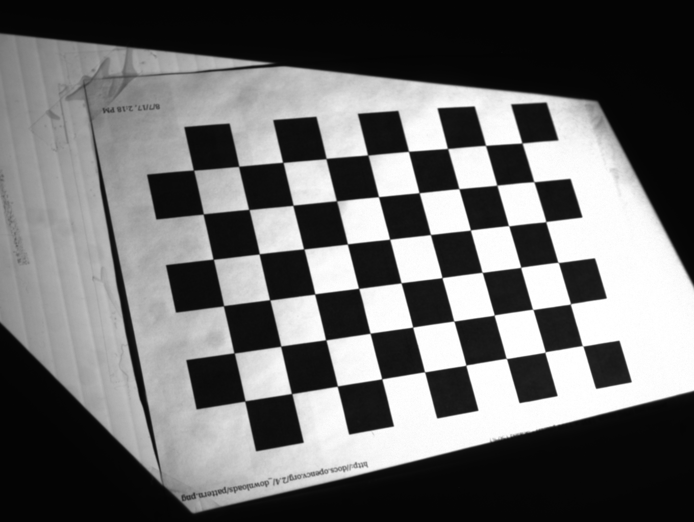

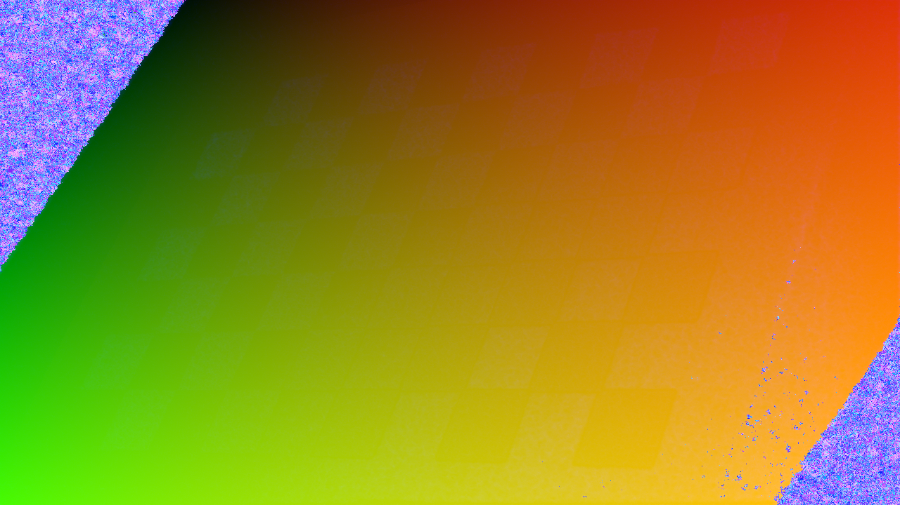

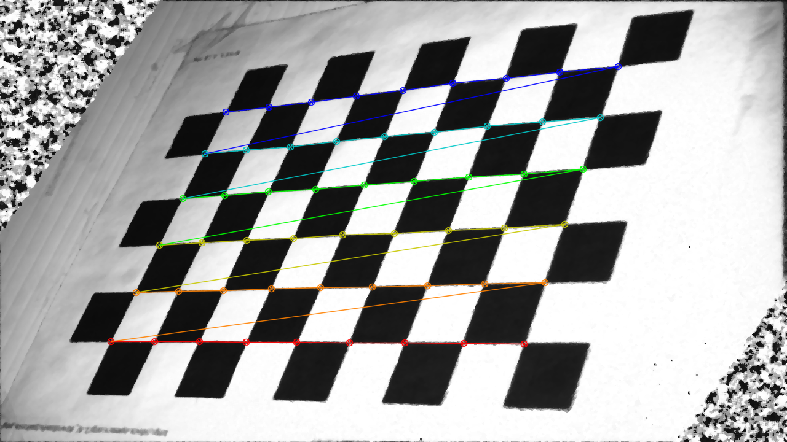

Le programme `flip-lut` en annexe permet de recalculer une image à
partir d'une LUT. La Figure 1 montre une image capturée par la caméra,
la Figure 2 présente la LUT obtenue par le match et la Figure 3 montre
le damier tel qu'il serait vu depuis le point de vue du projecteur.

Un exemple de calibrage du projecteur est également disponible en
annexe (`projector.dat`).

D'autres possibilités pour reconstruire l'image du projecteur seraient
à tester :

#### Par homographie

Selon la qualité du match, transformer une image via une LUT peut
donner une image bruitée. Une façon de contourner ce bruit serait de
calculer la transformation par homographie du plan capturé par la
caméra.

Plutôt que d'utiliser la LUT pour transformer pixel par pixel l'image
de la caméra, retrouver une homographie du damier satisfaisant un
petit nombre de points correspondants d'une image à l'autre devrait
permettre de retrouver la déformation donnant l'image de damier
recherchée.

#### Par bruit

Suite à une erreur de manipulation lors de la première tentative de
capture de damiers pour le projecteur, une autre idée à explorer est venue.

Le damier bien visible dans le bruit de la Figure 4 laisse présumer
qu'en utilisant une exposition délibérément trop faible au niveau de
la caméra, au point où les patterns dans les cases noires ne seraient
simplement plus distinguables des cases elles-mêmes sur les images
capturées, on pourrait utiliser directement le taux d'erreur dans le
match pour obtenir le damier requis pour le calibrage du projecteur.

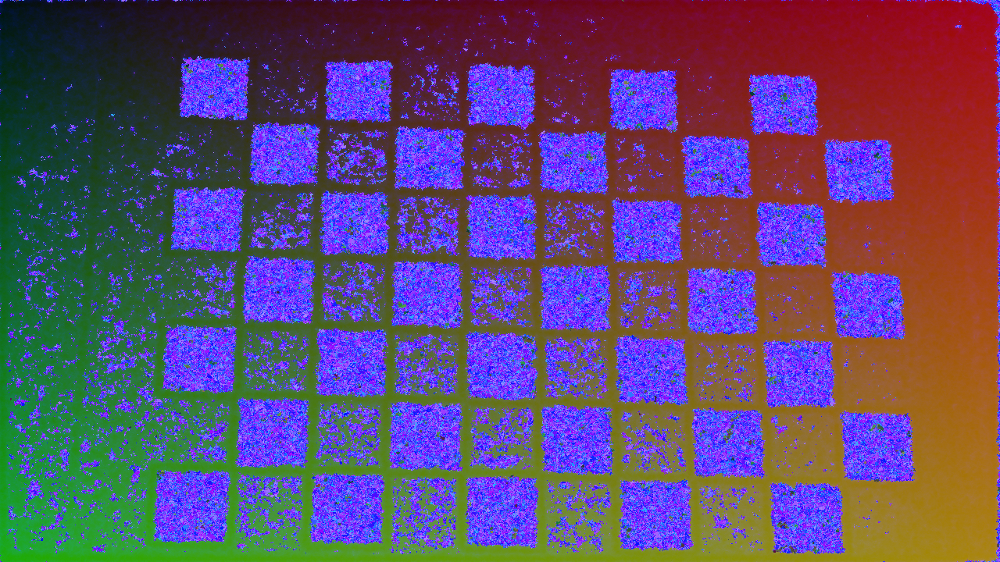

L'idée a été rapidement testée, mais les images capturées étaient trop
bruitées pour donner des résultats consistents et pertinents. La
Figure 5 montre cependant un des damiers extraits par ce processus
pour lequel la reconnaissance des patterns de damier a réussi.

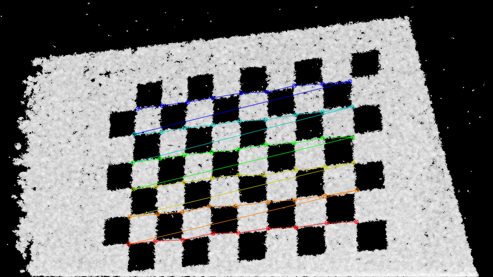

## "Disparité"

Une fois la caméra et le projecteur calibrés, des premiers scans de la
sculpture de pâtes ont été réalisés.

Une première visualisation de la qualité des scans s'est faite via une
carte de "disparités". Puisque le projecteur et la caméra étaient
alignés sur un axe horizontal, la différence entre la coordonnée X de
chaque pixel correspondant dans les deux images était relativement
représentative de la profondeur.

Une petite analyse des disparités est faite par le script `zdiff`
(voir en annexe) et donne le résultat sous forme de carte de
disparités (tel que présentée à la Figure 6) et de format textuel pour
analyse via le script `analyse-depths`.

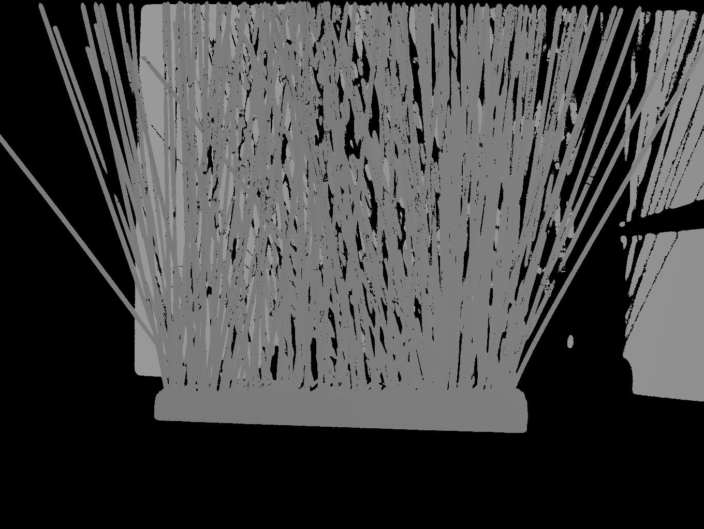

Une fois la carte de disparités extraite et les sections intéressantes
du scan connues, une carte de couleurs peut être générée via le script
`depths-to-colors` (voir la Figure 7).

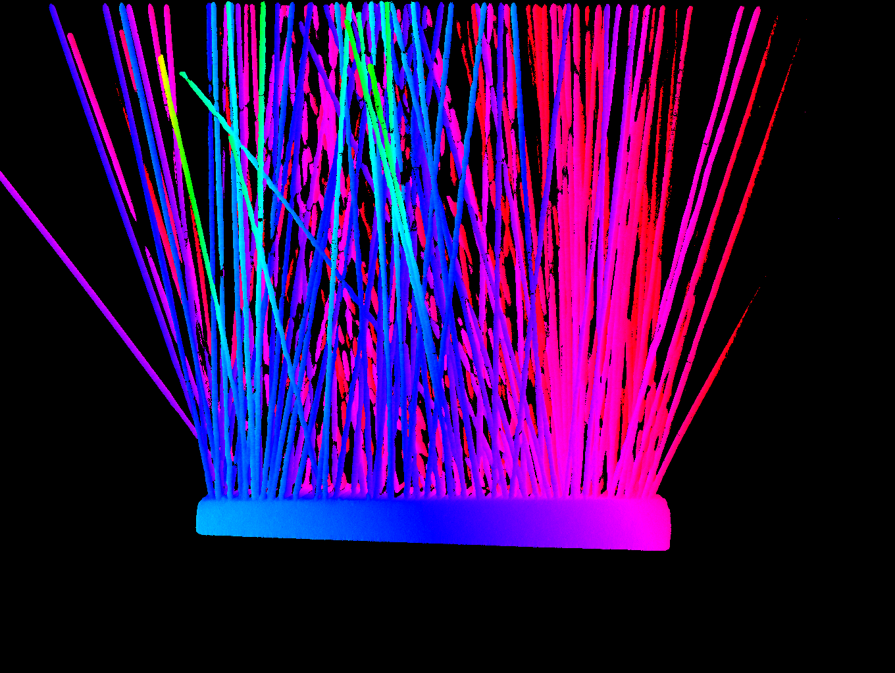

## Triangulation

Afin d'avoir une vraie mesure de la profondeur des objets de la scène
scannée, une triangulation des points mis en correspondances dans les
LUT est nécessaire.

Le script `triangulate.py` en annexe, inspiré de
[github.com/ChaimaElAsmi/scan3d](https://github.com/ChaimaElAsmi/scan3d/blob/master/triangulation.cpp),
prend en paramètre les LUTs caméra/projecteur calculées, les
calibrations de caméra et de projecteur associées (dans le format des
`.dat` utilisés en annexes) et génère en sortie une liste de points XYZ
et une image 16 bits à 3 canaux encodant pour chaque pixel dans
l'image une correspondance RGB -> XYZ dans le monde.

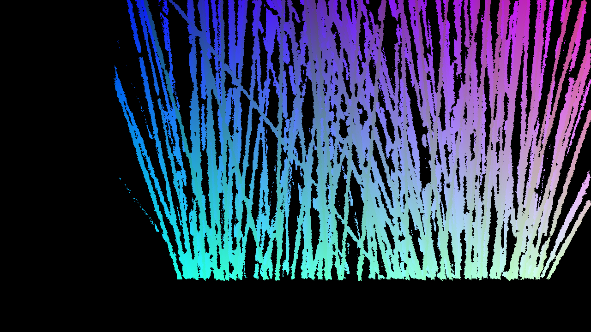

La liste de points au format XYZ peut être visualisée simplement en
utilisant le logiciel libre `paraview`\footnote{La visualisation dans
Mathematica d'un très grand nombre de points 3D a malheureusement ses
limites sur un laptop relativement humble comme le miens}, ce qui
donne une bonne idée de la qualité de la triangulation effectuée.

La visualisation des points triangulés a été cruciale dans la
détection d'un bug reliée à la distortion radiale calculée par OpenCV
lors du calibrage de la caméra. Comme le montre la Figure 9, les
premières reconstructions obtenues souffraient d'une distortion et
d'un désalignement.

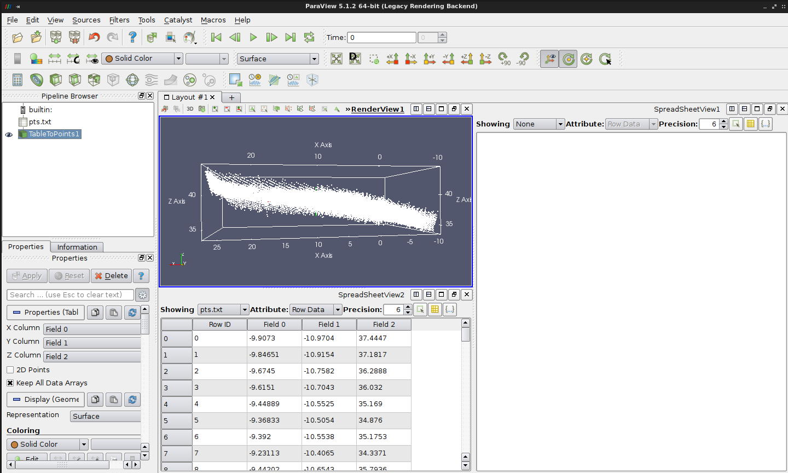

L'erreur a été corrigée en forçant la distortion radiale à zéro lors
du calibrage de la caméra. La raison pour laquelle OpenCV cherche à
trouver de la distortion radiale lorsqu'il n'y en a clairement pas
dans une image demeure un mystère.

En utilisant les bons coefficients de distortion radiale, la
reconstruction des scènes planaires donne des résultats visiblement
nettement meilleurs.

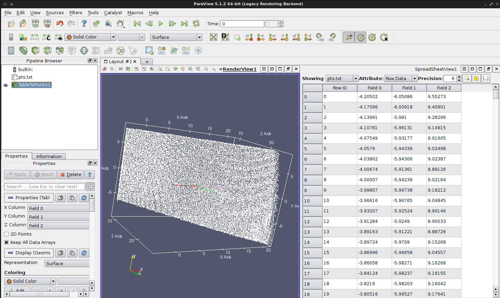

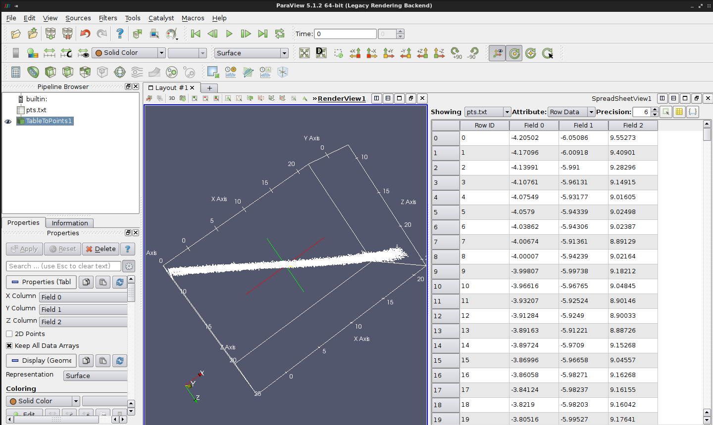

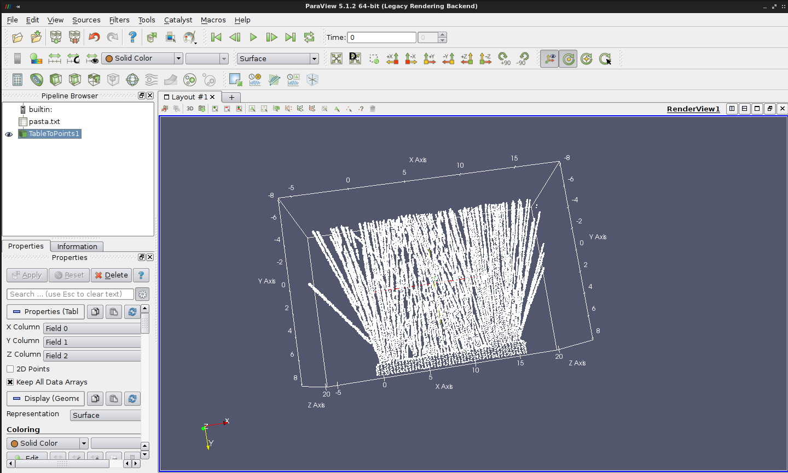

Une fois la carte de correspondances *pixel -> position du monde*
obtenue, on peut réutiliser le script `depths-to-colors` sur le canal
Bleu de l'image de correspondances pour projeter une couleur
directement associée au Z de chaque bout de pâte visible. Il en
ressort un dégradé bien visible, suivant l'axe des Z, tel que montré à
la Figure 13.

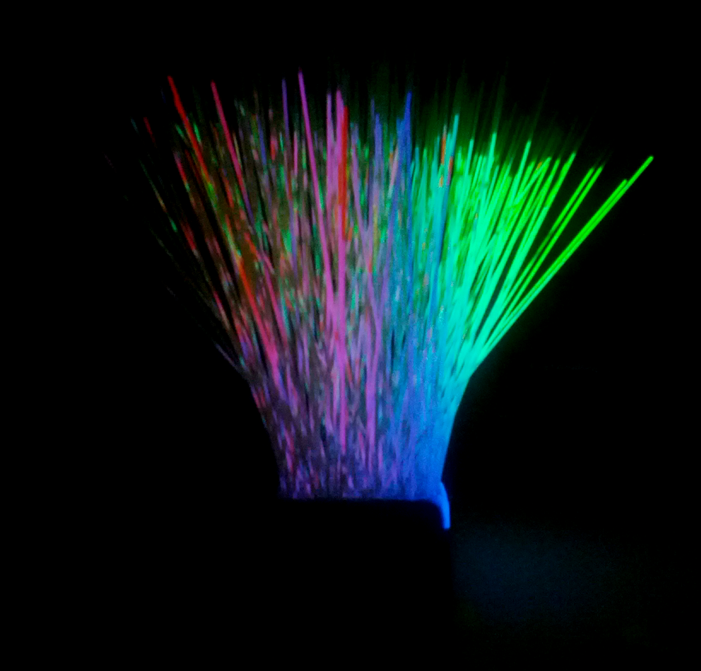

## Animation

Une des applications possibles les plus intéressantes du
*spaghettoscope* est la projection de modèles 3D dans un espace de
voxels, à la manière d'un hologramme.

Le script `animate.py` effectue une simulation physique minimale d'une
sphère ayant une position ($X_w$, $Y_w$, $Z_w$) dans le monde et fait le
rendu dans une image en se basant sur les profondeurs stockées dans
l'image de correspondances RGB->XYZ.

\newpage

L'algo de rasterization est le suivant :

    Pour chaque rangée #Y de l'image de sortie:
        Pour chaque colonne #X de l'image de sortie:
            Pour chaque modèle 3D obj dans la simulation:
                si obj intersecte la position du monde au pixel d'image (X, Y):
                    (X, Y) <- Couleur de l'objet

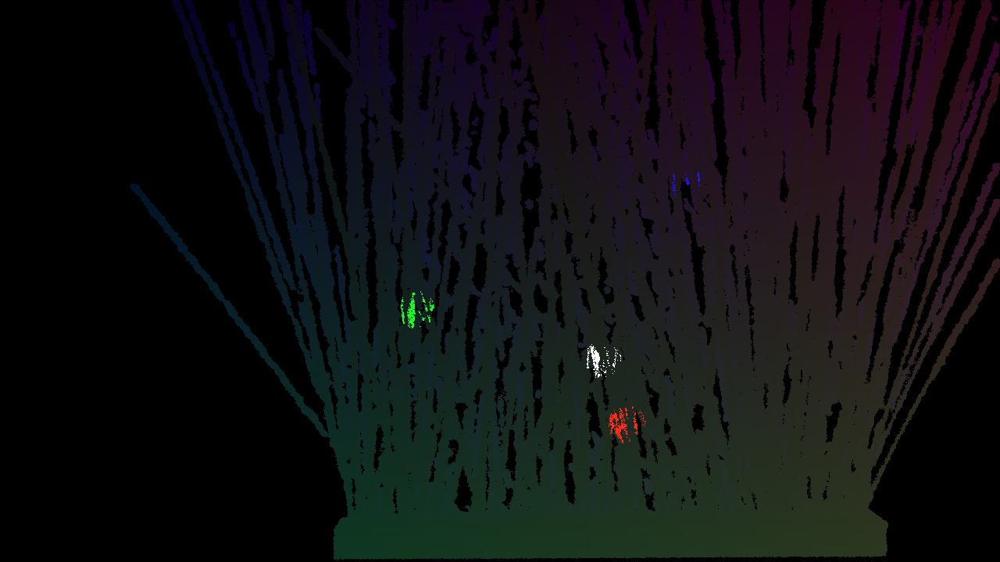

Afin d'améliorer la performance du rendu du script `animate.py`
(l'algo naïf étant particulièrement inefficace), une structure
d'accélération basée sur une grille de voxels et de boîtes englobantes
pour chaque modèle simulé a été implantée dans
`animate-axel.py`. L'effiacité de la génération des frames de
simulation est drastiquement augmentée par cette optimisation.

Une vidéo montrant la simulation d'un plan se déplaçant sur l'axe des
Z dans les pâtes est disponible ici : [http://316k.legtux.org/VID_20171220_162730.mp4](http://316k.legtux.org/VID_20171220_162730.mp4)

Après avoir obtenu des premiers résultats satisfaisants, un scan
utilisant des patterns de plus haute fréquence a été testé. La
reconstruction résultante est définitivement moins bruitée (voir la Figure 16), ce qui a
un impact visuel important lors de la reprojection de couleurs
associées à la profondeur sur la scène originale.

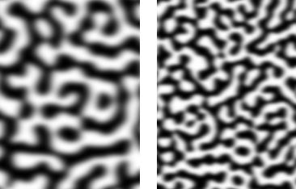

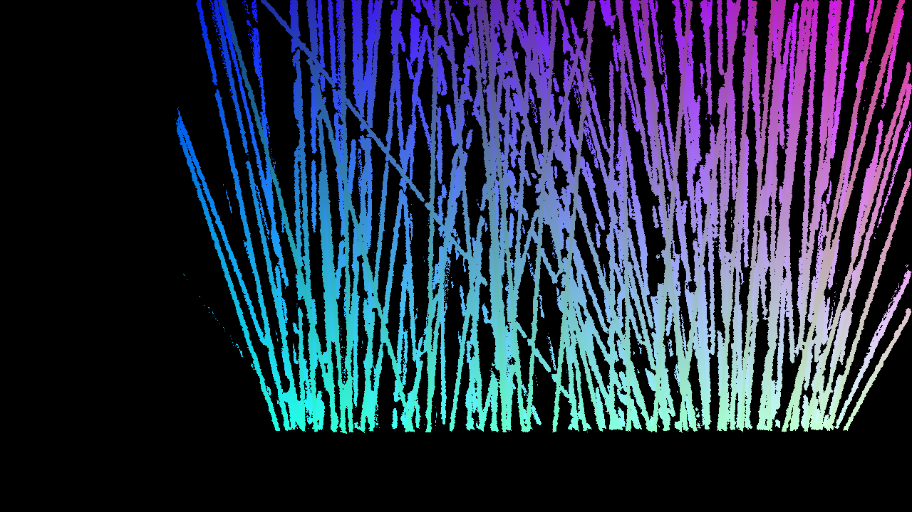

## Autres applications

Afin de tester les limites et la précision du scanner dans sa
configuration acutelle, un scan de visage humain a été
tenté. Pierre-André Brousseau s'est porté volontaire pour
l'expérimentation. Le projecteur et la caméra ayant besoin d'être
synchronisés, le sujet a dû rester immobile pendant une bonne minute,
ce qui n'était pas idéal autant pour la précision que pour son confort
durant le scan.

Le résultat est visuellement satisfaisant, comme en témoigne la Figure 17.

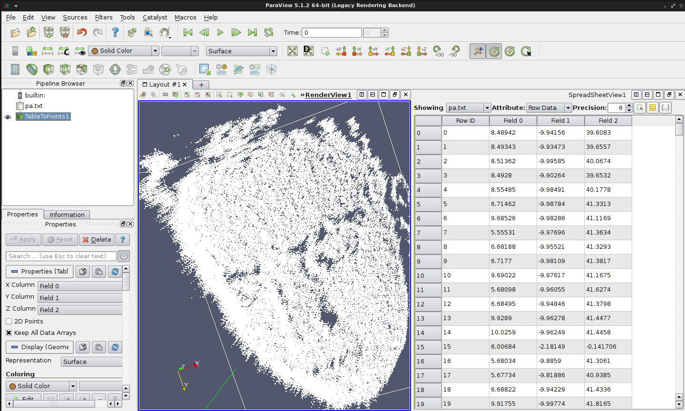

## Futurs développements

L'un des problèmes qui n'a pas été adressé lors du projet est la
question de la densité des pâtes à choisir pour la distribution sur le
bloc de styrofoam.

Une densité trop élevée ne permettrait pas d'allumer assez de voxels
loins du projeteur, tandis qu'une densité trop faible ne donnerait pas
accès à assez de voxels à allumer pour rendre le tout intéressant.

La répartition des pâtes s'est faite à l'oeil, créant un biais donnant
plus de visibilité aux pâtes les plus proches du projecteur.

Une simulation permettrait probablement de déterminer empiriquement
une bonne distance à garder entre les spaghettis pour avoir des
résultats idéaux considérant le volume à couvrir et une répartition
aléatoire la plus uniforme possible.

Synchroniser plus d'un projecteur pourrait également grandement aider
à obtenir de meilleurs résultats.

Au niveau de la simulation, les formes et couleurs supportées sont
plutôt primitives. Il serait définitivement intéressant d'intégrer des
fontionnalités plus intéressantes, telles qu'un shading plus complexe
des modèles.

De plus, avec assez de volume couvert, projeter des nuages de points
aurait définitivement un intérêt autant au niveau ludique (par
exemple, pour obtenir un hologramme du visage de Pierre-André en
rotation dans l'espace) qu'au niveau de la visualisation de données
3D/4D.

Finalement, il serait également intéressant de faire des tests avec
des pâtes ayant un rayon légèrement plus grand. Les pâtes utilisées
dans ce projet sont des spaghettinis, et utiliser plutôt des
spaghettis pourrait potentiellement avoir un impact au niveau du bruit
visible dans les couleurs projettées sur la scène (soient des couleurs
se retrouvant en une profondeur Z mal calculée).
